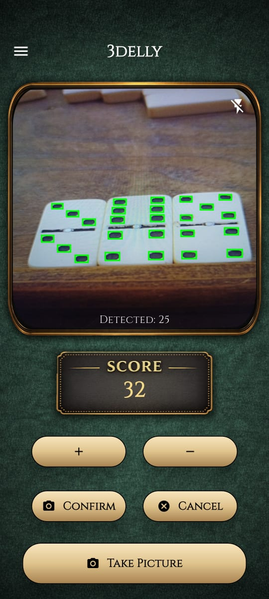
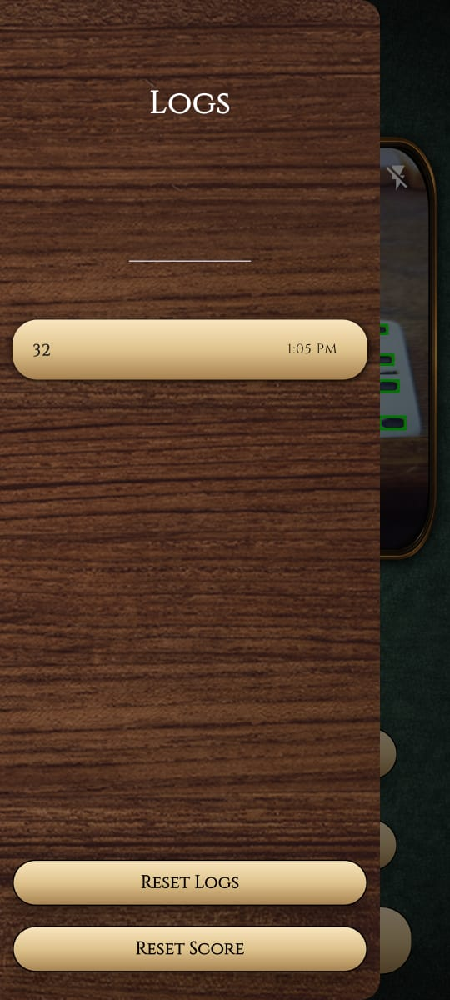

# 3delly (Flutter)

An **AI-powered dominoes counting app** built with Flutter.
It allows players to automatically detect and count domino tiles quickly and easily—so you can focus on playing instead of counting.

---

## 🚀 Features

- 🎯 AI Domino Detection
    A dedicated suprevised machine learning model that was trained on labeled real-world dataset 
- 📊 Score Tracking
    Keep track of your score
- 🧾 Logs
    Record and review the full game flow.
- 🔄 Undo & Reset
    Easily fix mistakes or restart the game anytime.
- 🎨 Modern UI
    Simple, elegant, and easy-to-use design.

---

## 🛠 Tech Stack

- **Flutter** (Dart)  
- camera  
- ultralytics_yolo 
- shared_preferences
- Material Design  

---

## 🧠 Architecture Overview

<pre>
lib/
│── models/        # Data models
│── services/      # Database & AI logic
│── screens/       # UI screens
│── widgets/       # Reusable components
│── main.dart      # Entry point
</pre>

---

## 🧠 How It Works

The app uses a dedicated suprevised machine learning model to:

Capture domino tiles via camera
Detect each tile
Count the dots (pips) automatically
Calculate total scores instantly

This removes the need for manual counting and reduces human error.

---

## 📸 Screenshots

  
  

---
